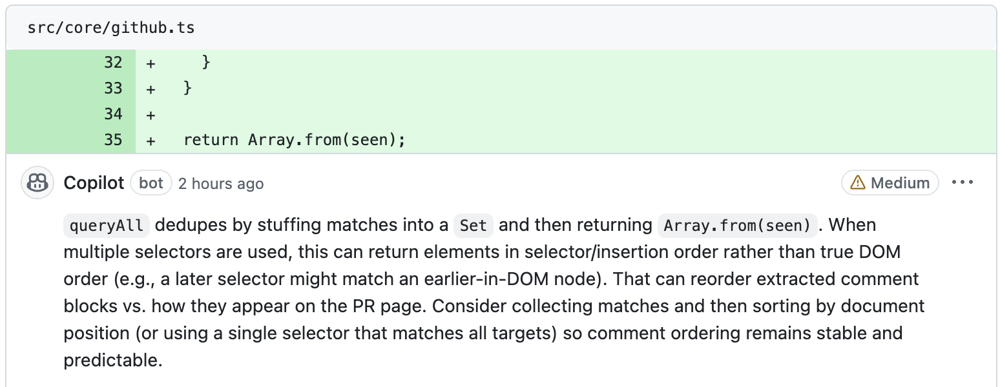
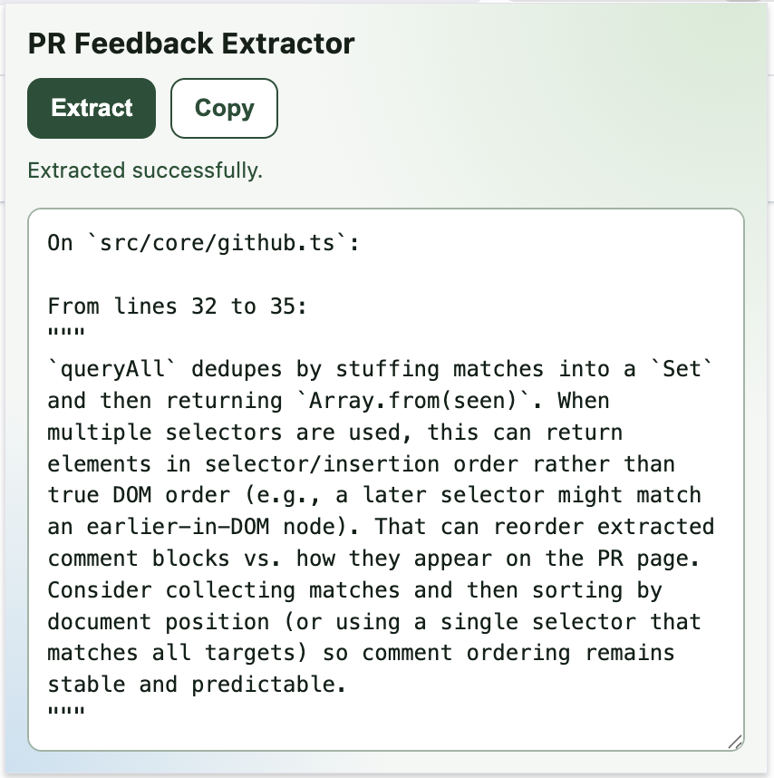

# PR Feedback Extractor

A Chrome/Brave extension that reads GitHub pull request review comments and outputs copy-ready feedback grouped by file.

## Expected Behavior

This screenshot shows a GitHub pull request with inline review feedback:



And the extension produces the extracted grouped output shown here:



## Build

```bash
npm install
npm run build
```

Load the generated `dist/` folder via `chrome://extensions` or `brave://extensions` using **Load unpacked**.

Licensed under Apache License 2.0.
